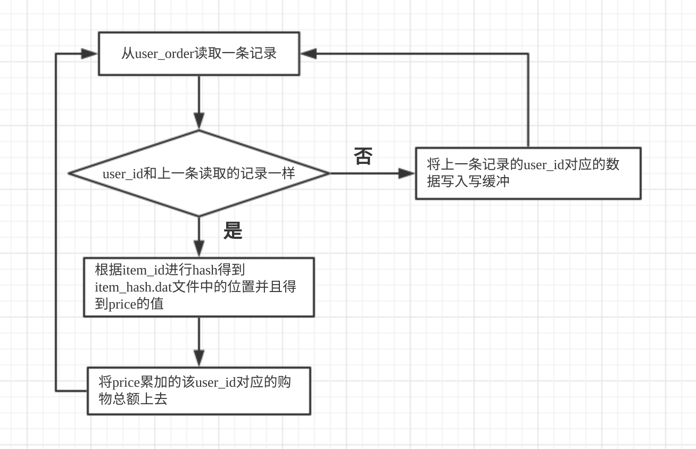

# 题目

---

Calculate how much money each user has spent efficiently

• In a machine with 8 CPU cores, 4GB MEM, and 4TB HDD disk, there are two files:
 · A 1TB file with (item_id: uint64, item_price: uint64), which contains a lot of records about the price of each item.
 · A 1TB file with (user_id: uint64, item_id: uint64), which contains a lot of records about the items each user purchased.

- The files are unordered.
- Each item has an unique item_id.
- Each user has an unique user_id.
- Each user can purchase one or more different or the same items.

• Please write a program to calculate how much money each user has spent efficiently and output the result to the disk.
You can use your favorite language, but we prefer C/C++, Rust, Go, or Python.

提示：
· 注意代码可读性，添加必要的注释（英文）
· 注意代码风格与规范，添加必要的单元测试和文档
· 注意异常处理，尝试优化性能

# 总体思路

---

输入：user.dat(user_id和item_id两个字段), item.dat(item_id和price两个字段)，文件大小都远大于内存

步骤：

- 先使用外部排序将user.dat(1T)整理为有序的user_order.dat(1T)，此过程为顺序读写，需要遍历两遍user.dat
- 然后将item.dat文件中的每条记录进行hash，整理成一个item_hash.dat(负载因子为0.75,线性探测法，占用空间约1.33T)，此过程为顺序读，随机写，需要遍历一遍item.dat
- 最后遍历user.dat对每个user的购物总额进行汇总，每汇总完一个user就把一条记录写入buffer中，遍历一遍user.dat，顺序读user.dat，随机读item.dat

方案特点：

- 总计遍历3遍user.dat，1遍item.dat
- 尽可能地采用顺序读写

# 魔鬼在细节

---

## 外部排序

---

### InitRun

线程安排：

- 一个读线程负责读user.dat文件，读满读缓冲后，等待另一个读缓冲被消费完进行与其进行交换，能够最大程度减少主线程因为读文件被阻塞的时间
- 一个写线程负责往tmp-xx.dat写文件，全部落盘之后等待另一个写缓冲被写满与其进行交换，能够最大程度减少主线程因为写文件被阻塞的时间
- 主线程负责内存中的置换选择算法

运行结果：

几个有序的文件，平均每个文件的大小为2 * memory

按照题目中说的8G内存的话，假设我用6G的堆外内存跑置换选择算法，那么平均每个文件大小为12G，1T的话大约有86个tmp文件

### 多路归并

线程安排：

- 读线程：一个读线程负责全部的tmp文件的读取，其唤醒与休眠由工单队列进行控制，初始时向其提交将所有的BlockingQueue填满的工单，之后每耗尽一个读缓冲才会提交一个工单，令其读取对应的tmp文件，最大程度减少主线程的阻塞
- 主线程：主线程负责处理多路归并的逻辑，初始时向工单队列提交填充满全部BlockingQueue的工单，之后每消耗完一个缓冲才向读线程提交工单
- 写线程：负责写入user_order.dat文件，写缓冲交替写入。

运行结果：

一个按照user_id有序的user_order.dat文件

内存占用：

经过测试，读写速度基本是一致的，每个BlockingQueue的容量设置为2即可，这个阶段的内存占用很小，只有大约2 * 86 * 4k = 688k，大约0.5个G，这个阶段的瓶颈不在内存，所以内存再大也没有什么用。

### 外部排序为什么不直接使用已有的开源的库？

其实外部排序在github上有一些开源的java库，比如[Externalsortinginjava](https://github.com/lemire/externalsortinginjava)，又或者是[external-sort](https://github.com/htyleo/external-sort)，但是研究了一下他们的实现都有一些共性的问题：

- 直接将数据读进了java堆内，在内存比较紧张的情况下，对GC很不友好，容易使程序受到GC困扰
- 必须要先将byte转成string才能进行比较(compare)，比较(compare)性能比较低下，而且可能触发GC。像本题中的8B的key，更好的做法是以基本类型long的形式读入堆内，不仅比较(compare)性能更好，而且完全没有GC
- 同步读写，无法充分利用多核CPU
- 没有实现置换选择算法

而我手写的这个外部排序可以克服上面的缺点：

- 将数据主体放在堆外，每次需要比较(compare)的时候将8B的key以基本类型long的形式读入堆内，对于GC非常友好，比较(compare)的效率也较高
- 异步读写，尽可能减少主线程阻塞的时间
- 实现了置换选择算法，初始有序序列(init run)的大小可以是内存大小的2倍

## Hash

---

约定hash的负载因子为0.75，然后使用mmap直接在内存中映射出相应大小的文件，对于item.dat的每条记录，使用`item_id % 文件大小`决定其在mmap中的位置，然后将数据写入相应位置，如果遇到冲突则采用线性探测法继续探测下一个位置。

运行结果：

item的数据都被hash到了item_hash.dat文件中，按负载因子0.75算的话，item_hash.dat的大小约为1.33T

## 汇总

---

使用mmap将user_order.dat和item_hash.dat两个文件分别用mmap映射到内存，然后按如下逻辑汇总：

以上逻辑足够应付各种情况。